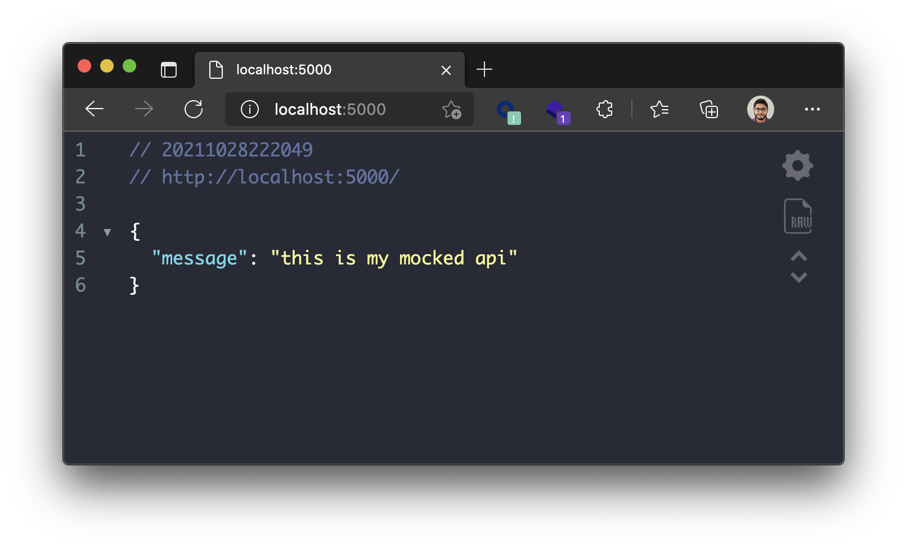

# Simple Python JSON Mock Server

This repository contains a simple implementation of a static JSON mock server built with Flask. Contains also, everything you need to deploy a aplication using it.

The mock just accepts `GET` method.

## Getting started

To see this in action, everything you need to do is run a docker-compose build.

```shell
$ docker-compose up web
```

Now, go to http://localhost:5000.



## How to use

### Mocks

The mocks are stored at `mock_server/responses` as static `json` files. See the [example.json](./mock_server/responses/example.json) file.

```json
{
    "message": "this is my mocked api"
}
```

If you want to add another mocked responses, just add another json files to this folder.

### Routes

The routes are defined at `mock_server/routes.py`. See the initial content of the file.

```python
from flask import Flask
from mock_server.parser import route

def build_routes(app: Flask):
    route(app, route='/', mock_name='example')
``` 

The route function expects to receive 3 arguments:

| Argument | Description |
|-|-|
| `app` | The instance of a flask app |
| `route` | The route you will retrieve |
| `mock_name` | The name of the static response json file without the `.json` extension |

